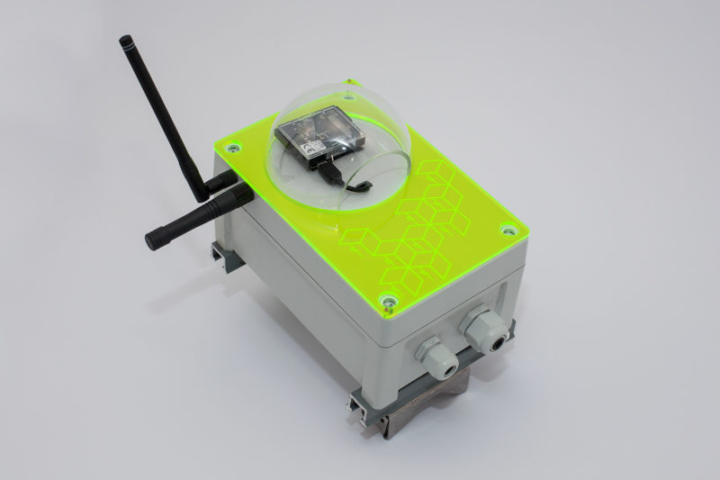
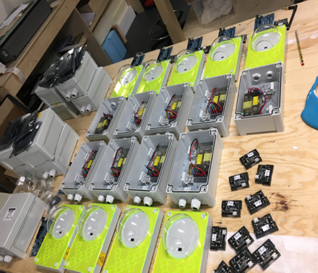

# ICRI Envirosensor Platform
This repository provides the scripts used to setup and run the experimental Envirosensor environmental sensing platform created in collaboration between [The Bartlett Centre for Advanced Spatial Analysis (CASA)](https://www.ucl.ac.uk/bartlett/casa/) with the [Intel Collaborative Research Institute (ICRI) for Urban IoT](http://cities.io/). This readme document outlines the process for setting up and running the Envirosensor platform for research purposes and reference. It does not provide a guide to Envirosensor assembly.

The Envirosensor is based around Intel’s Arduino expansion board and Intel Edison compute module. An  image of the Yokto Poky Linux distribution for embedded systems is used to provide the board’s operating system. A Ti CC2650STK SensorTag is attached to the Arduino board via the SimpleLink SensorTag Debugger DevPack. These components are linked internally with a standard USB cable and housed in a customised weather proof box containing a transformer for providing mains power.

## Envirosensor Deployment
In April 2018 twenty devices were deployed in the newly opened UCL campus at the Here East innovation centre on the Queen Elizabeth Olympic Park in London. The trial ran for a 6 month period. During this time the data gathered from the Envirosensors was visualised in near real time using a digital 3D model as a Digital Twin. Further information about the project and its motivation can be found in the following paper:

### Dawkins, O., Dennett, A., Hudson-Smith, A. (2018) Living with a Digital Twin: Operational management and engagement using IoT and Mixed Realities at UCL’s Here East Campus on the Queen Elizabeth Olympic Park. GISRUK 2018, Leicester. [[PDF]](https://www.researchgate.net/profile/Oliver_Dawkins/publication/324702983_Living_with_a_Digital_Twin_Operational_management_and_engagement_using_IoT_and_Mixed_Realities_at_UCL%27s_Here_East_Campus_on_the_Queen_Elizabeth_Olympic_Park/links/5adddd11a6fdcc29358ba112/Living-with-a-Digital-Twin-Operational-management-and-engagement-using-IoT-and-Mixed-Realities-at-UCLs-Here-East-Campus-on-the-Queen-Elizabeth-Olympic-Park.pdf)

# Envirosensor Function
The Envirosensor runs the Linux operating system (see Software section below for details). Each device's identity and WiFi connection details are setup when it is flashed with the operating system image for the first time. A Bash script `setup.sh` is used to: download required software and dependencies; enable a service `envirosensor.sh` with configuration `envirosensor.service` in order to restart the device if it fails; and finally to configure the device's connection to a cloud based service where data from each device is aggregated. The connection settings are stored in another configuration file `envirosensor.config` that is generated from user input during the setup procedure. 

The Ti SensorTag connected to the Edison records and transmits readings for temperature, humidity, pressure and ambient light levels which are transmitted to the Edison via the USB serial connection. The main Python script `envirosensor.py` is used to read the transmitted bytes, construct a json data payload and upload this to the chosen cloud service, in this case the IBM Iot Platform via a RestAPI.

**Note:** The setup of the Ti SensorTag is not discussed in this document.

## Components
- Intel Edison Compute Module and Arduino Expansion Board: https://software.intel.com/en-us/intel-edison-board-user-guide
-	Ti SensorTag: http://www.ti.com/ww/en/wireless_connectivity/sensortag/
-	SimpleLink SensorTag Debugger DevPack: http://www.ti.com/tool/CC-DEVPACK-DEBUG 

## Software
-	Intel Edison Yocto Poky image: https://downloadcenter.intel.com/download/27074/Intel-Edison-Yocto-Poky-image 
- Miniconda open source distribution of Python: https://conda.io/miniconda.html

**Note:** Intel has discontinued the Arduino expansion board and Edison compute module developer kits. Its online resources and forum communities will be withdrawn on June 15, 2020.

# Device Setup And Operation

## Device Power
-	The power supply for each sensor box provides just enough power for the Edison and attached Ti SensorTag.
  -	In each sensor box there is a transformer providing 5 volts to power the Intel Edison and Ti Sensor Tag.
- The potentiometer on the power supply needs to be turned all the way up on each device:
  -	Ensure the potentiometer is turned up fully by turning the screw clockwise.
  -	If the potentiometer isn’t turned up the device will keep rebooting.
  -	When the device is functioning there will be a steady green light and a second green light will turn on when the serial connection to the SensorTag is read.
- The Arduino expansion board features 4 connectors (left to right) for power and communication:
  - Barrel connector for an external 7-15 V DC power supply.
  - USB port (Type-A) used for connecting to the Ti SensorTag DevPak.
  - Micro USB (Type-B) used for powering the device over USB.
  - Micro USB (Type-B) used for creating a terminal connection over USB (e.g. using PUTTY).
-	The microswitch selector in between the Type-A USB port and innermost micro USB is used to switch between two modes of device operation:
  -	Device mode (right) – Used when flashing the board and mounting the on-board flash memory like a disk drive.
  - Host mode (left) – Used during sensor operation for reading the SensorTag attached to the main USB port.
-	During operation:
  -	When flashing the board (Device Mode) you need to disconnect the mains power and use the inner micro USB port to provide power to the board. The outer micro USB will be used to communicate with the board via PUTTY.
  -	When the sensor is running after flashing (Host Mode) you will need to have the device connected to the mains. Communication with the device can be established over the outer micro USB using PUTTY or wirelessly using WinSCP.

## Login to device via USB with Putty
-	Ensure the device is powered and connect the device to a laptop or desktop computer.
-	Check COM port in Device Manager for its USB Serial Port number.
-	Open Putty.
-	Change the connection type to ‘Serial’, enter the COM port and change the speed to ‘115200’.
-	Hit ‘Open’ to bring up command line.
•	Enter a username and password.
•	Edison uses Linux commands e.g. `ifconfig` to check IP address.
•	Close the connection.

**Note:** Linux allows for the creation of system services that run using config files as soon as the device is activated. For the ICRI Environment Sensor project this has been called ‘envirosensor’ with a shell script.

## Flash and configure the device
1. Open the command line interface on the Laptop connected to the device.
2. Find `iot-devkit-prof-dev-image-edison-20160606` folder on hard drive containing flash scripts.
3. Run `flashall.bat`.
4. When prompted…Connect serial and power ports to laptop and move switch to right.
5. Login to Edison `root` using Putty.
6. Type `configure_edison --password`.
7. Enter a password at the prompt. For ease you can use the same password for each device.
8. Type `configure_edison --wifi` and wait for it to scan.
9. Enter number of preferred network and provide password when prompted.
10.	Note the IP address.
11.	Unplug serial connections from the device and move switch to left position to draw power from the electrical mains adapter.

## Load Files Wirelessly (WinSCP)
This is the preferred method for loading files onto the device and is used where the WiFi network allows SSH connections to the device. Accessing the devices via SSH will enable you to deploy code to the devices and debug them remotely over the Internet. For public wifi networks this may require contacting the wifi network provider and arranging to have the devices whitelisted and assigned a static IP address. The machine you use to connect to the sensors may also require a static IP address. If this is not possible see instructions below for loading files via USB.
1.	Go to WinSCP to access device via WiFi.
2.	Go up a few levels from the home directory to the top directory on the device to check that required files and directories are present.
3.	Copy across the setup folder and envirosensor.py script to the /home/root/ folder.
4.	Open Putty in WinSCP to run across SSH.
5.	Navigate to the home/root/setup folder and run setup script: `sh setup.sh`
6.	Enter config details like API key and device details.
7.	If there are issues with your setup script and configuration files check that they are Unix encoded using sublime text.
8.	Check that the file `envirosensor.config` has been created and contains the required entries. 
**Note:** If the config file is empty you can either enter it manually using Nano or else delete the file and rerun the setup process.
9.	Type `shutdown` to stop the device.
10.	Unplug USB cables from PC and plug back in.
11.	Log in with Putty to check services are running (name of service = envirosensor)
  - Check active services – `systemctl list-units --type=service`
  -	Check current status - `systemctl status <name of service>`
  - Stop service – `systemctl stop <name of service>`
  - Start service - `systemctl start <name of service>`
  - NANO is loaded for editing text files
12.	Unplug USB cable, plug in mains cable and flip switch.

## Load Files over USB (Putty)
This is done when SSH is not available as when using the Universities free wifi service Eduroam which prevents incoming SSH connections. In this case loading files onto the device and debugging them requires a physical connection.
1. Connect Edison's USB port to your PC. You should see a new drive appearing in File Explorer.
2. Copy the files from your machine to the flash drive on Edison.
3. In File Explorer 'Eject' the Edison's flash drive.
4. Log in to the Edison using Putty.
5. Mount the Edison flash partition in a folder called 'flash' using the following commands:
  - `mkdir flash`
  - `mount -o offset=8192 /dev/mmcblk0p9 flash`
6. Copy the files from the mounted directory to their final destination:
  - `cp -rf ./flash/envirosensor.py ~`
  - `cp -rf ./flash/setup ~`
7. Check that he files and folders will now be in the correct location.
8. Delete the flash folder: `rm -r flash` 
**Note:** You may not be able to the flash directory right away as the flash drive may be busy, but you should be able to after restarting the device.
9. Go to step 5 in the section on Loading Files Wirelessly above to run the envirosensor setup script.

## Editing Code
Code can be edited using a suitable text editor such as Sublime text on WinSCP or Nano text editor via Putty.
1. Make sure the services are stopped – `systemctl stop <name of service>`.
2. Check service has stopped by confirming status – `systemctl status <name of service>`.
3. Processes can be killed using `kill %<number of process e.g. 1>`.
a. This can be important as multiple locked processes slow the device.
b. REPEAT THE KILL until it returns `No such process` in the console.
c. Caused by hitting CTRL + Z to stop processes.
4. Start the miniconda environment `source /home/root/miniconda2/bin/activate root` to setup dependencies to run your script.
5. You can check what Conda environments are running by typing `conda info --envs`.
6. If dependencies are missing they need to be installed e.g. MRAA: '$HOME/miniconda2/bin/conda install -y -c malev mraa=0.9.3`.
7.	Test script by typing `python envirosensor.py`.
8.	To stop the script type `CTRL+C` or else `CTRL+Z` if that doesn’t work.
9.	If there are issues with your script check that the files on the Edison are Unix encoded using sublime text and make sure spaces are used for indentation rather than tabs.
 
## Troubleshooting Services
1.	Enable volatile logging with journalctl by navigating to `/etc/systemd` in the file system.
2.	Open `journald.conf` with your text editor.
3.	Change the Storage parameter value from `none to Storage=volatile` in order to temporarily store the logs in memory.
4.	The command `systemctl status <name of service> -l` will provide additional logging.
5.	The command `journalctl -u <name of service>.service` will provide logs for the particular service. Additional filters can be added such as `--since today` etc.

# Acknowledgements
Thank you to the [Intel Collaborative Research Institute (ICRI) for Urban IoT](http://cities.io/) for providing the Envirosensor platform.
Special thanks to ICRI researchers Duncan Wilson, Sarah Gallacher and Sokratis Kartakis for technical support and advice.
Thanks also to the [Future Cities Catapult](https://futurecities.catapult.org.uk/) at the Urban Innovation Centre in London for use of their maker space facilities during the construction and testing of the devices.

This project is linked to research at CASA funded by the [Engineering and Physical Science Research Council (EPSRC)](https://epsrc.ukri.org/) and [Ordnance Survey (OS)](https://www.ordnancesurvey.co.uk/), the national mapping agency for Great Britain. 
